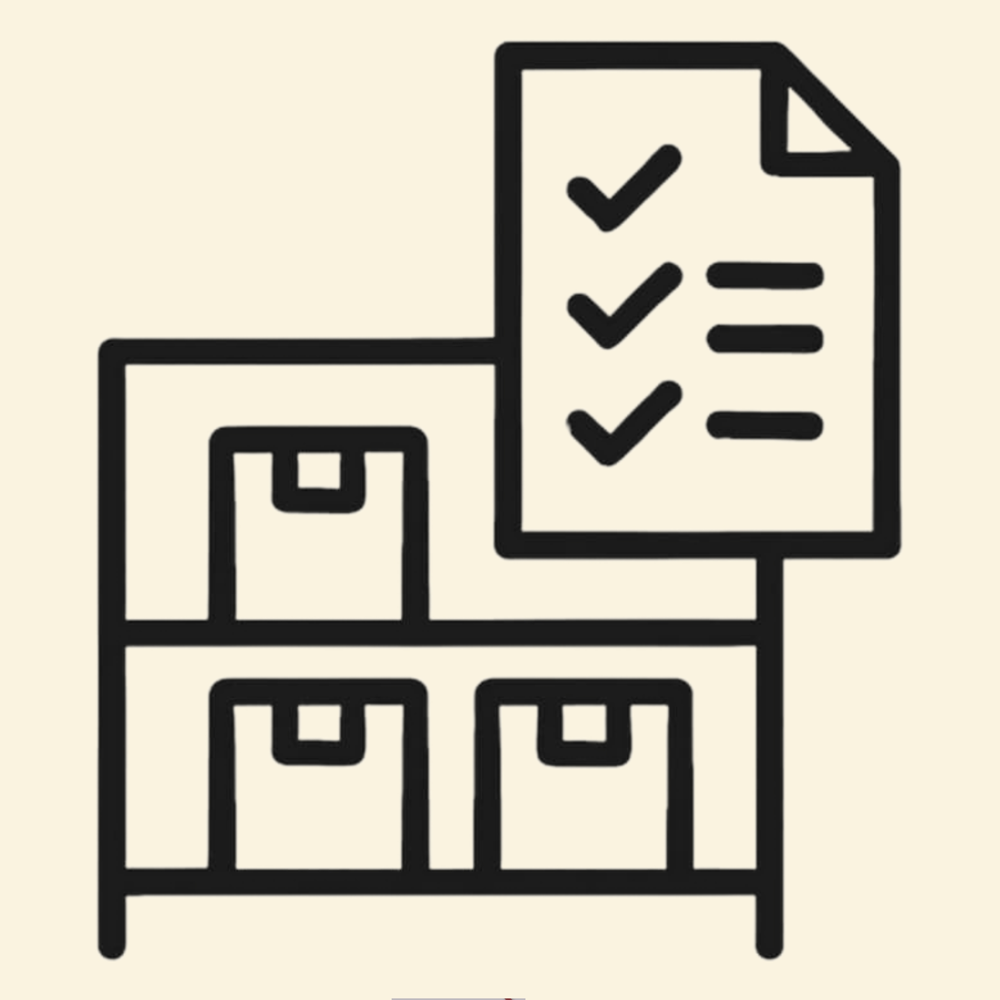

# 📦 NventoryBud

<div align="center">

<p align="center">
  
</p>

### *Your buddy for smarter sales and inventory*

[](https://flutter.dev)
[](https://dart.dev)
[](https://opensource.org/licenses/MIT)

A simple yet powerful Flutter mobile app for small businesses to manage inventory, track sales, and generate reports.

[Features](#-features) • [Installation](#-installation) • [Usage](#-usage) • [Project Structure](#️-project-structure)

</div>

---

## ✨ Features

<table>
<tr>
<td width="50%">

### 🛍️ **Product Management**
- Add, update, and delete products
- Restock inventory with ease
- Filter by categories
- Automatic duplicate prevention

</td>
<td width="50%">

### 💰 **Sales Recording**
- Quick sales transactions
- Real-time inventory updates
- Stock validation
- Sold-out notifications

</td>
</tr>
<tr>
<td width="50%">

### 📊 **Analytics Dashboard**
- Interactive pie charts
- Inventory & sales visualization
- Category filtering
- Revenue calculations

</td>
<td width="50%">

### 📄 **Reports & Receipts**
- Generate timestamped receipts
- View sales history
- Track best-selling products
- Export-ready reports

</td>
</tr>
<tr>
<td colspan="2">

### ℹ️ **Help Center**
- In-app user guide with step-by-step instructions
- Feature explanations for each module
- Support contact information
- Perfect for first-time users

</td>
</tr>
</table>

---

## 🚀 Installation

### Prerequisites
- [Flutter SDK](https://flutter.dev/docs/get-started/install) (3.8.0 or higher)
- Android Studio / VS Code with Flutter extensions
- Android/iOS device or emulator

### Quick Start

```bash
# 1. Clone the repository
git clone https://github.com/Ceihiro/nventorybud-app.git
cd nventorybud

# 2. Install dependencies
flutter pub get

# 3. Run the app
flutter run
```

### Required Assets Structure
```
assets/
├── NventoryBud.png              # Splash screen logo
├── analyticsbg.png              # Analytics background
├── fonts/
│   └── Forrest-Light.otf        # Custom font
└── icons/
    ├── app.jpg
    ├── product.png
    ├── sale.png
    ├── analytic.png
    └── report.png
```

> **Note:** All assets are already configured in `pubspec.yaml`

---

## 📖 Usage

<div align="center">

| Step | Action | Description |
|:----:|--------|-------------|
| **1** | 🏠 **Launch App** | Splash screen appears, then navigate to home |
| **2** | ➕ **Add Products** | Go to Products → Fill form → Add to inventory |
| **3** | 💳 **Record Sales** | Go to Sales → Enter product & quantity → Sold |
| **4** | 📊 **View Analytics** | Check pie charts for inventory and sales trends |
| **5** | 📄 **Generate Reports** | Create receipts and view sales history |

</div>

### Product Management
```
Products Page → Enter Details → Add Product
- Existing products: Quantity accumulates
- New products: Added to inventory
```

### Recording Sales
```
Sales Page → Product Name + Quantity → Sold
✓ Validates stock availability
✓ Updates inventory automatically
✓ Shows sold-out alerts
```

### Analytics
```
Analytics Page:
├── Inventory Tab: Current stock levels (pie chart)
└── Sold Products Tab: Sales performance (sort by most/least sold)
```

### Reports
```
Reports Page:
├── View total sales & top items
├── Generate Receipt → Saves snapshot
└── Reset Sold Products → Start new period
```

### Help Center
```
Help Page:
├── Welcome guide & app overview
├── Step-by-step feature tutorials
└── Support contact information
```

---

## 📦 Dependencies

| Package | Version | Purpose |
|---------|---------|---------|
| `flutter` | SDK | Framework |
| `intl` | ^0.17.0 | Date & currency formatting |
| `path_provider` | ^2.0.11 | File system access |
| `fl_chart` | ^0.68.0 | Pie chart visualization |
| `cupertino_icons` | ^1.0.8 | iOS-style icons |

---

## 💾 Data Storage

All data is stored locally in the app's documents directory:

- **`inventory.txt`**: Products (CSV format)
  ```
  product,price,quantity,category,sold
  ```
- **`receipts.txt`**: Sales receipts (JSON format)
  ```
  ISO8601_date|JSON_content
  ```

**Features:**
- ✅ Automatic save on every change
- ✅ Persistent across app restarts
- ✅ No internet required

---

## 🏗️ Project Structure

```
lib/
├── main.dart              # Entry point & navigation
├── splash_screen.dart     # Initial loading screen
├── product_page.dart      # Product CRUD operations
├── sales_page.dart        # Sales transactions
├── analytics_page.dart    # Data visualization
├── report_page.dart       # Receipt generation
└── help_page.dart         # User guide
```

**File Links:**
- [`main.dart`](lib/main.dart) - Entry point & navigation
- [`splash_screen.dart`](lib/splash_screen.dart) - Initial loading screen
- [`product_page.dart`](lib/product_page.dart) - Product CRUD operations
- [`sales_page.dart`](lib/sales_page.dart) - Sales transactions
- [`analytics_page.dart`](lib/analytics_page.dart) - Data visualization
- [`report_page.dart`](lib/report_page.dart) - Receipt generation
- [`help_page.dart`](lib/help_page.dart) - User guide

---

## 🎨 Design

- **Color Scheme**: 
  - Primary: `#007BA7` (Blue)
  - Background: `#faf3e0` (Cream)
  - Accent: Red for destructive actions
- **Typography**: Custom "MyFont" (Forrest-Light)
- **Icons**: Material Design + custom assets

---

## 🤝 Contributing

This is a completed school project created for educational purposes. 

While the code is public for learning and reference, **this project is not actively maintained**.

Feel free to fork it for your own learning!

---

## ⚠️ Educational Purpose

This project was created as a school project while learning Flutter development. It is functional and open for learning and improvement.

**Feel free to use this as a learning resource or adapt it for your own projects!**

---

## 👥 Team

This project was developed by a team of 3 as a final project for our Object-Oriented Programming subject.

- **Developer** — project setup, core features, and full implementation
- **Designer** — UI/UX design and visual assets  
- **Researcher** — research and assisted with coding

---

## 📝 License

This project is licensed under the MIT License - see the [LICENSE](LICENSE) file for details.

---

## 🆘 Support

For questions, bug reports, or feature requests, please open an issue on GitHub:
- 🐛 [Report an Issue](https://github.com/Ceihiro/nventorybud-app/issues)

---

<div align="center">

### Made with ❤️ using Flutter

**⭐ Star this repo if you find it helpful!**

[](https://github.com/Ceihiro/nventorybud-app)
[](https://github.com/Ceihiro/nventorybud-app/fork)

---

**[⬆ Back to Top](#-nventorybud)**

</div>
